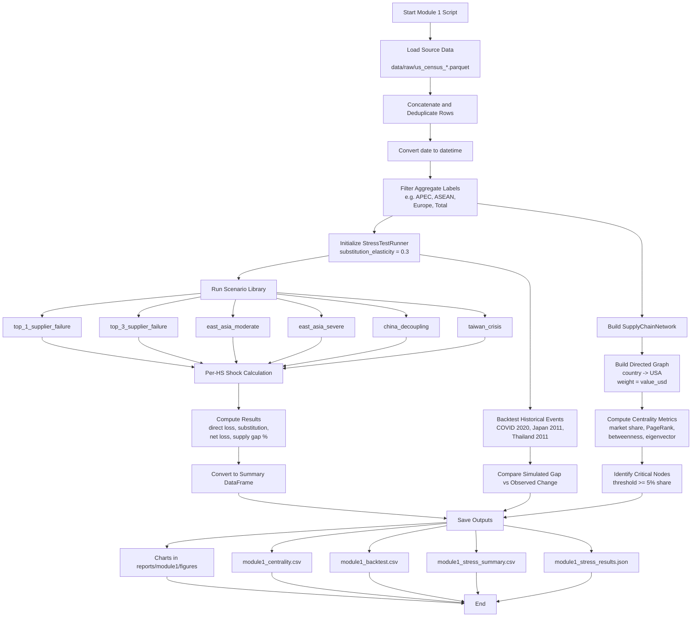

# Module 1 Flowchart

## Notes

- Source data is US Census trade parquet files loaded from data/raw.
- Core modeling is HS-level shock propagation with substitution limits.
- Scenario conclusions are based mainly on supply_gap_pct and substitution_absorbed_pct.
